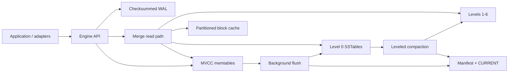

# MeteorDB

Embedded ordered storage for local applications and AI infrastructure.

MeteorDB is a synchronous Rust key/value engine with a persistent LSM tree,
atomic batches, MVCC snapshots, scans, TTLs, and typed adapters for inference
caches, feature history, and embedding storage.

> **Pre-alpha:** API and file-format compatibility are not guaranteed between
> releases. Keep another copy of important data and test recovery before use.

## Capabilities

| Capability | Status |
| --- | --- |
| WAL recovery, memtable flush, SSTables, Bloom filters, block cache | Implemented |
| Atomic batches and snapshot-consistent point/range/prefix reads | Implemented |
| Leveled compaction and safe obsolete-file reclamation | Implemented |
| Wall-clock TTL visibility and expiry-aware compaction | Implemented |
| Inference-cache, feature-store, and embedding-storage adapters | Implemented |
| Bounded read-only inspector and reproducible benchmark harness | Implemented |
| General transactions, repair, backup/checkpoint, replication | Not implemented |
| Approximate-nearest-neighbor indexing/search | Non-goal |
| RocksDB file/API compatibility | Non-goal |

## Requirements

- Rust 1.88.0 (selected by `rust-toolchain.toml`)
- a C compiler/linker available as `cc`
- Linux, macOS, or another platform with the filesystem semantics described in
  [durability](docs/durability.md)

## Core quickstart

```bash
cargo run -p meteordb --example quickstart
```

```rust
use meteordb::{Engine, Options, Result, WriteBatch};

fn use_database(path: &std::path::Path) -> Result<()> {
    let engine = Engine::open(Options::new(path))?;
    let mut batch = WriteBatch::default();
    batch.put("profile:42", "engineer").put("team:42", "storage");
    engine.write(batch)?;

    let snapshot = engine.snapshot()?;
    engine.put("profile:42", "researcher")?;
    assert_eq!(snapshot.get("profile:42")?.as_deref(), Some(&b"engineer"[..]));

    let rows = engine
        .scan_prefix("profile:", 100)?
        .collect::<Result<Vec<_>>>()?;
    assert_eq!(rows.len(), 1);
    drop(snapshot);
    engine.close()
}
```

The runnable example owns a temporary directory and demonstrates clean
shutdown. `Engine::open` creates or recovers the database.

## AI adapter quickstart

```bash
cargo run -p meteordb --example ai_adapters
```

The adapters are namespace-isolated layers over the same engine:

- `InferenceCache` canonicalizes model requests, supports TTL and
  process-local singleflight.
- `FeatureStore` stores typed event-time rows and supports exact, latest,
  as-of, and history reads.
- `EmbeddingStore` stores checked F32/F16 vectors and metadata, including
  atomic batch puts and snapshot-consistent batch gets.

They store and retrieve vectors; they do **not** implement similarity scoring
or ANN indexes.

## Architecture



Writes are logged before publication. Reads merge memory and the immutable
version selected for the operation. Flush and compaction install and sync new
files before a manifest edit publishes them. See [architecture](docs/architecture.md),
[durability](docs/durability.md), and [file formats](docs/file-formats.md).

## Operations and limitations

- `Durability::Sync` is the default. `Buffered` may lose acknowledged writes
  on power loss until `sync` or `close` succeeds.
- TTL uses absolute Unix milliseconds. Snapshots freeze MVCC sequence, **not
  time**. Clocks must not move backward while open or across a reopen.
- A complete checksum/format/ordering error is corruption and fails the
  operation; only documented incomplete final WAL/manifest tails are ignored
  or truncated during recovery.
- One process opens a database for writing at a time. This is an embedded
  library, not a network or distributed database.
- Compaction is explicit with `Engine::compact`; background work flushes
  memtables but does not continuously compact.

## Inspect a database

Inspection does not recover, truncate, or take the writer lock:

```bash
cargo run -p meteordb-cli -- --path ./db check --format json
cargo run -p meteordb-cli -- --path ./db dump-manifest --format json
cargo run -p meteordb-cli -- --path ./db dump-sstable \
  --file 000042.sst --max-entries 100 --max-bytes 1048576
```

Use the documented limits when files are untrusted. Details and exit behavior
are in [operations](docs/operations.md).

## Benchmarks

Component smoke:

```bash
cargo bench -p meteordb --bench engine -- --test
cargo bench -p meteordb --bench workloads -- --test
```

Deterministic comparison harness:

```bash
scripts/run-benchmark-comparison.sh --engine meteordb --smoke
```

RocksDB comparison is optional and needs C++, CMake, pkg-config, and libclang:

```bash
scripts/check-rocksdb-bench-deps.sh
scripts/run-benchmark-comparison.sh --engine rocksdb --smoke
```

The two engines are not format- or API-compatible, and TTL/compaction semantics
are explicitly non-equivalent. MeteorDB publishes methodology, not universal
performance claims. See [reproducible benchmarks](docs/benchmarks.md).

## Documentation and contributing

- [Documentation map](docs/README.md)
- [API documentation](https://docs.rs/meteordb)
- [Roadmap and status](ROADMAP.md)
- [Contribution guide](CONTRIBUTING.md)
- [Development and release gates](docs/development.md)
- [Changelog](CHANGELOG.md)
- [Security policy](SECURITY.md)

## License

[MIT](LICENSE)
