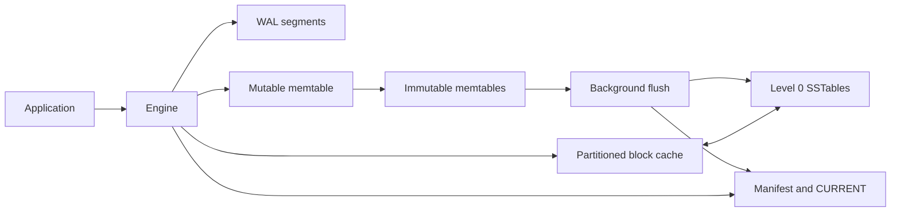

# MeteorDB

Embedded storage for latency-sensitive AI infrastructure.

MeteorDB is an ordered byte-key/byte-value engine for applications that need
durable local state with predictable point lookups. It is designed as a storage
foundation for inference caches, feature data, and embedding metadata without
requiring those workload-specific adapters in the core engine.

> **Pre-alpha:** The file format and API may change without migration support.
> Do not use MeteorDB as the only copy of production data.

## Why MeteorDB

AI infrastructure often needs more than an in-memory map but less than a
remote database. MeteorDB keeps the storage engine in-process, orders arbitrary
byte keys, makes batches atomic, and provides snapshot point reads. Its current
focus is correctness across WAL recovery, memtable flush, immutable SSTables,
and durable metadata.

## Current capabilities

| Capability | Status |
| --- | --- |
| Checksummed write-ahead log | Implemented |
| Atomic write batches | Implemented |
| MVCC snapshot point reads | Implemented |
| Memtable rotation and background flush | Implemented |
| Immutable SSTables | Implemented |
| Per-table Bloom filters | Implemented |
| Durable manifest recovery | Implemented |
| Level-aware point reads | Implemented |
| Partitioned block cache | Implemented |
| Read-path and cache statistics | Implemented |
| Range and prefix scans | Roadmap |
| Compaction and version reclamation | Roadmap |
| TTL enforcement | Roadmap |
| AI workload adapters | Roadmap |
| Published benchmark results | Roadmap |

## Quickstart

MeteorDB requires Rust 1.88 and a native linker available as `cc`.

```bash
cargo build --workspace
cargo test --workspace
cargo run -p meteordb --example quickstart
```

The central API is synchronous and uses owned byte-compatible inputs:

```rust
use meteordb::{Engine, Options, Result, WriteBatch};

fn use_database(path: &std::path::Path) -> Result<()> {
    let engine = Engine::open(Options::new(path))?;

    let mut batch = WriteBatch::default();
    batch
        .put("feature:user:42", "enabled")
        .put("profile:user:42", "database engineer");
    engine.write(batch)?;

    let snapshot = engine.snapshot()?;
    engine.put("profile:user:42", "systems engineer")?;
    assert_eq!(
        snapshot.get("profile:user:42")?.as_deref(),
        Some(b"database engineer".as_slice())
    );

    drop(snapshot);
    engine.close()
}
```

See the [complete runnable example](crates/meteordb/examples/quickstart.rs) for
database-directory ownership and cleanup.

## Architecture



Writes enter the WAL before becoming visible in the mutable memtable. Rotation
moves a full memtable to a background flush queue; the resulting SSTable is
published through the manifest before its WAL can be retired. Point reads
search memory first and then the live SSTables recorded by the manifest.

Read the [architecture reference](docs/architecture.md) for recovery,
concurrency, and correctness details.

## Repository

| Path | Purpose |
| --- | --- |
| [`crates/meteordb/src`](crates/meteordb/src) | Storage-engine implementation |
| [`crates/meteordb/tests`](crates/meteordb/tests) | Cross-component integration tests |
| [`crates/meteordb/examples`](crates/meteordb/examples) | Runnable API examples |
| [`docs`](docs) | Product and technical documentation |

## Documentation

- [Documentation map](docs/README.md)
- [Architecture](docs/architecture.md)
- [Storage-engine concepts](docs/storage-engine.md)
- [Roadmap](ROADMAP.md)

## Contributing

MeteorDB welcomes focused changes with tests for correctness-sensitive
behavior. Before submitting a change, run:

```bash
cargo fmt --check
cargo clippy --workspace --all-targets -- -D warnings
cargo test --workspace
git diff --check
```

Keep public claims aligned with code on `main`, preserve durability ordering,
and include corruption or recovery cases when changing persistent formats.

## License

MeteorDB is available under the [MIT License](LICENSE).
