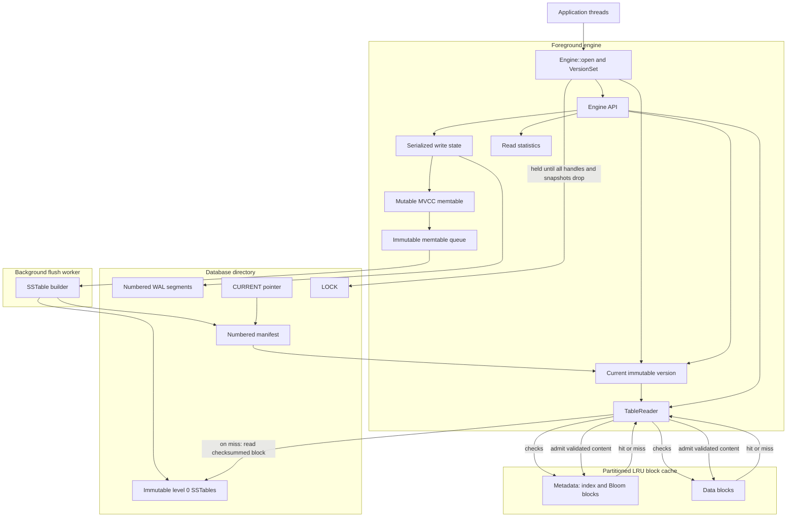
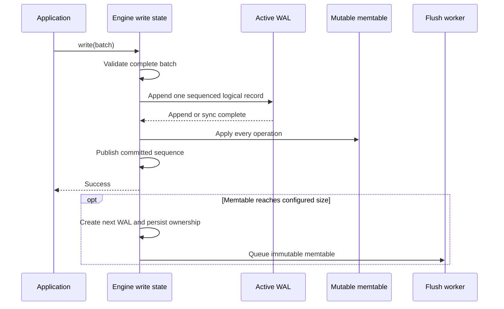
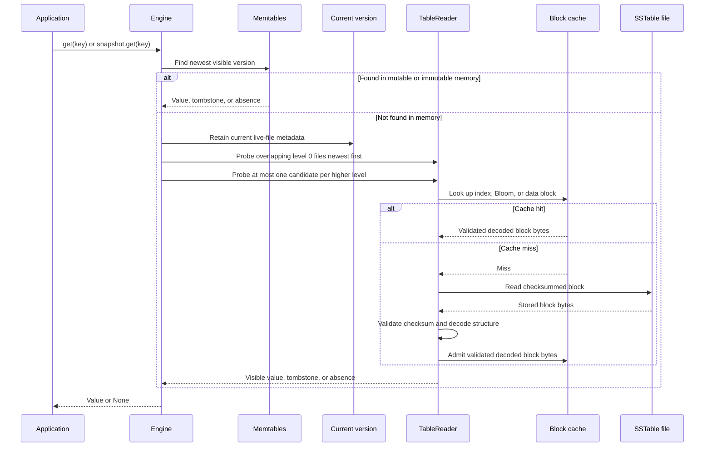

# Architecture

## System overview

MeteorDB is an embedded LSM storage engine. One `Engine` owns the active WAL,
mutable and immutable memtables, a background flush worker, the durable
manifest, live SSTable metadata, a partitioned block cache, and read
statistics.

New flush output enters level 0. The version model represents seven levels and
the point-read path understands their lookup rules, but automatic compaction
between levels is not implemented.

## Write path

A mutex gives writers a total order. Every operation in a batch receives one
sequence number. With synchronous durability, the WAL is synchronized before
the batch reaches the memtable; buffered durability requires an explicit
`sync` or `close` to upgrade acknowledged writes.

## Point-read path

An ordinary read uses the latest published sequence. A snapshot captures a
fixed sequence and retains it for its lifetime. Bloom-filter negatives avoid
data-block reads but positive results still require a key lookup. The engine
constructs a `TableReader` for a candidate file; the reader, not the SSTable
file, checks and fills the block cache.

## Flush and recovery

When the active memtable crosses `memtable_bytes`, MeteorDB creates a new WAL,
persists the new WAL ownership in the manifest, and moves the old memtable to
the immutable queue. The flush worker builds a temporary SSTable, atomically
installs it, synchronizes the directory, and appends a manifest edit that
publishes the file in level 0. Only then can the corresponding obsolete WAL be
removed.

On open, MeteorDB:

1. acquires the database lock;
2. creates a manifest or follows `CURRENT` to recover the existing one;
3. validates referenced SSTables and removes unpublished table files;
4. replays every required WAL in sequence order into immutable memtables;
5. creates a fresh active WAL and durably records recovery counters; and
6. starts the flush worker to persist recovered memtables.

Recovery distinguishes an incomplete final append from damage to complete
bytes. A structurally short final WAL header or payload, or an unfinished final
fragment chain, is treated as a torn tail and ignored. The same structural
cases at the end of a manifest are truncated back to the last complete record
before appending resumes. Checksum mismatches, invalid fragment ordering,
missing required WAL or SSTable files, sequence gaps, and inconsistent manifest
metadata instead return typed corruption or I/O errors; none is accepted as a
partial logical write.

## On-disk ownership

| File | Owner and lifetime |
| --- | --- |
| `LOCK` | Acquired during `Engine::open` and held by the shared `VersionSet` until every `Engine` clone and `Snapshot` is dropped; `Engine::close` alone does not release it |
| `CURRENT` | Names the active manifest |
| `MANIFEST-NNNNNN` | Append-only version edits and recovery counters |
| `NNNNNN.wal` | Owned by one mutable or immutable memtable until flush is durable |
| `NNNNNN.sst` | Immutable table owned by every live version that references it |
| `NNNNNN.sst.tmp` | In-progress flush output; removed during recovery if unpublished |

File numbers are allocated monotonically across WALs, manifests, and SSTables
so recovery does not silently reuse durable names.

## Concurrency model

- `Engine` is cloneable and shares one internal state.
- A single mutex serializes writes, rotation, manifest publication, and
  in-memory version selection.
- Reads inspect memtables while holding that state lock, retain an immutable
  version, then perform SSTable I/O without the write-state lock.
- One background thread flushes immutable memtables in queue order.
- Snapshot registration is thread-safe and fixes visibility to one sequence.
- The block cache has independent metadata and data budgets under its own
  mutex.
- A terminal WAL, manifest, or background flush failure prevents unsafe
  continued operation.

## Correctness invariants

1. A batch becomes visible only after its complete WAL record succeeds.
2. One batch has one sequence number and is never partially applied.
3. Readers never observe a sequence newer than their selected read sequence.
4. A flushed SSTable is installed and synchronized before the manifest
   publishes it.
5. A WAL remains owned until all data that requires it is represented by
   durable recovery state.
6. `CURRENT` identifies the manifest used for recovery.
7. Level 0 files may overlap; files within each higher level must not overlap.
8. SSTables and published versions are immutable.
9. Structurally incomplete final WAL records are ignored and incomplete final
   manifest records are truncated according to their recovery rules.
10. Corrupt checksums, invalid fragment or sequence ordering, missing required
    files, and inconsistent recovery metadata fail open with typed errors.

## Module map

| Module | Responsibility |
| --- | --- |
| `engine` | Public operations, sequencing, rotation, flush, recovery, and point reads |
| `wal` | Checksummed fragmented batch log and replay |
| `memtable` | Ordered in-memory MVCC versions |
| `sstable` | Immutable table format, builder, reader, index, and Bloom blocks |
| `manifest` | Durable version edits, `CURRENT`, locking, and recovery |
| `version` | Immutable live-file metadata and level invariants |
| `cache` | Partitioned LRU cache for metadata and data blocks |
| `stats` | Point-read, Bloom, level-probe, and cache snapshots |
| `snapshot` | Active snapshot sequence tracking |
| `fs` | Durable filesystem boundary used by production and crash tests |
| `options` | Resource limits and durability configuration |
| `batch` | Owned atomic write batches |
| `internal_key` | User-key, sequence, and value-kind ordering |
| `background` | Flush-worker signaling |
