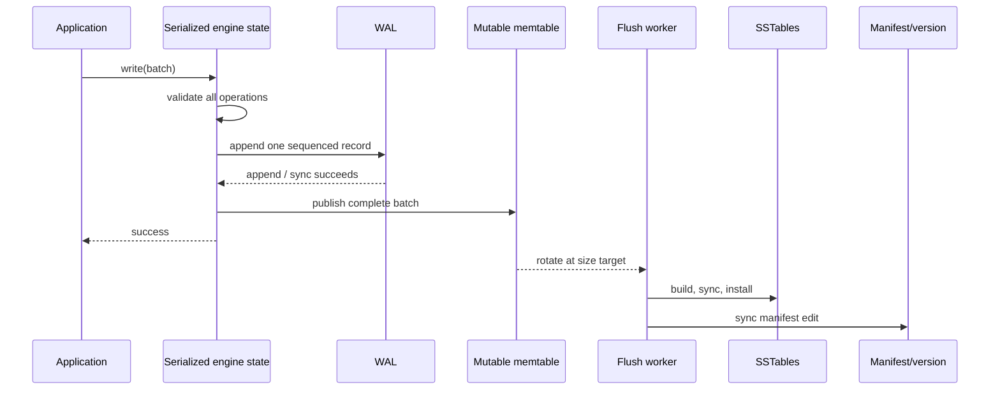
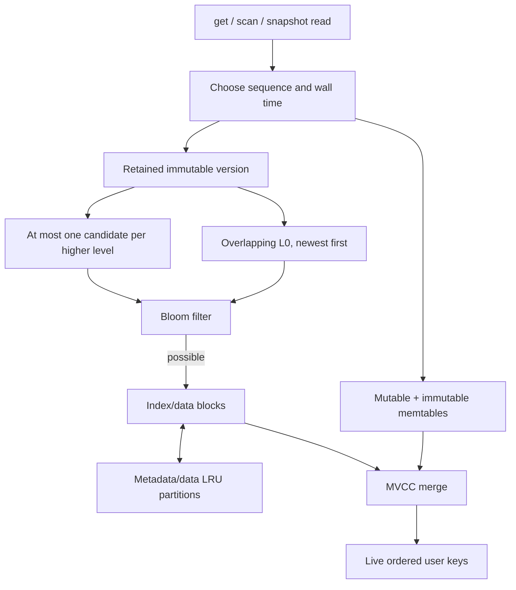

# Architecture

MeteorDB is an embedded LSM engine. An `Engine` owns the writer lock, current
WAL, mutable and immutable MVCC memtables, immutable version metadata, block
cache, statistics, and a flush worker.

## Data paths

Every batch receives one sequence number. The write mutex establishes order;
publication occurs only after the WAL append succeeds. `Sync` durability syncs
before returning. `Buffered` defers that guarantee to `sync` or `close`.

Point reads and lazy scans use the latest published sequence; snapshots retain
their captured sequence and version lifetime. TTL visibility is evaluated
against wall time selected when the read/iterator is created. Bloom negatives
avoid data-block reads. Positives can be false and always require lookup.

## Flush and compaction

Rotation creates and durably records a new WAL before queueing the old
memtable. Flush builds a temporary SSTable, installs and synchronizes it, then
publishes it in the manifest. Only durable replacement state permits WAL
retirement.

`Engine::compact` first flushes, then selects one highest-priority overfull
level. It merges the input level and overlapping next-level tables, drops
versions hidden from every active snapshot, removes expired values at the
compaction clock time, splits output near the target size, installs all output,
and atomically publishes additions/removals in one manifest edit. Readers
retaining the old version keep input files alive until their leases end.

LSM trade-offs are explicit: sequential foreground writes and immutable files
cost write amplification during compaction; overlapping L0 tables increase
read amplification; obsolete versions consume space until eligible
compaction. Size settings are targets, not hard file limits.

## Recovery

Open acquires `LOCK`, follows `CURRENT`, validates and replays the manifest,
validates referenced tables, removes unpublished temporary/table output,
replays the required contiguous WAL range, creates a fresh active WAL, records
recovery counters, and resumes pending flushes.

A structurally incomplete final WAL record is treated as a torn tail. An
incomplete final manifest record is truncated to its last complete boundary.
Checksum mismatches, invalid fragment ordering, non-canonical encodings,
sequence gaps, missing required files, and inconsistent metadata are typed
errors—not misses or empty data. See [durability](durability.md).

## Concurrency and ownership

- `Engine` clones share one process-local engine; `LOCK` excludes another
  writer.
- Writes, rotation, and version publication are serialized.
- Reads retain an immutable version and perform table I/O without the writer
  mutex.
- A single worker drains immutable memtables. Compaction is caller-driven.
- Terminal WAL/manifest/background failures prevent unsafe continued writes.
- `close` closes shared engine state; the OS lock remains owned until all
  handles, snapshots, and iterators release it.

## Correctness invariants

1. No batch is visible before its complete WAL append succeeds.
2. A batch is all-or-nothing at one sequence.
3. A read never observes a sequence newer than its selected sequence.
4. Files are installed and synchronized before metadata publishes them.
5. WALs and compaction inputs remain owned until replacement state is durable
   and no live reader retains them.
6. Complete corruption is never downgraded to a miss or torn tail.
7. Level 0 may overlap; each higher level is non-overlapping.
8. Published SSTables and versions are immutable.
9. TTL does not alter MVCC sequence semantics and snapshots do not freeze time.

## Module map

| Module | Responsibility |
| --- | --- |
| `engine`, `background` | API, sequencing, recovery, flush, lifecycle |
| `wal`, `manifest`, `version` | durable log and live-file metadata |
| `memtable`, `sstable`, `iter` | MVCC storage and merged reads |
| `compaction` | selection, merge, version/file reclamation |
| `cache`, `bloom`, `stats` | read avoidance and observability |
| `clock` | injectable non-decreasing wall time |
| `workloads` | inference, feature, and embedding adapters |
| `fs` | production and fault-injection filesystem boundary |
