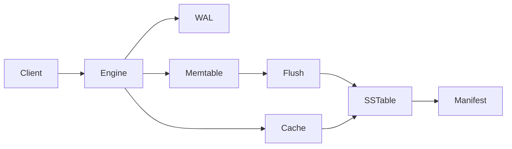

# Repository Structure

MeteorDB's repository is organized as a product surface for users,
contributors, and maintainers. Public documentation separates the quick path
from deeper implementation detail so the root README remains useful without
becoming a reference manual.

## Documentation layers

1. **Root README** — product identity, current capabilities, quickstart,
   architecture overview, and links to deeper documentation.
2. **Product documentation** — architecture, storage concepts, roadmap,
   development workflow, security policy, and contribution guidelines.
3. **Directory READMEs** — local orientation next to the code, examples, and
   tests they describe.
4. **Rustdoc** — exact API contracts, units, failure semantics, and safety
   invariants.

The repository does not expose agent transcripts, generated implementation
plans, or process-specific scratch files as product documentation.

## Product voice

MeteorDB is described as an embedded storage engine under active development,
not as a tutorial or portfolio project. Documentation must:

- state implemented capabilities and limitations accurately;
- avoid unsupported performance or production-readiness claims;
- explain how to evaluate, use, and contribute to the engine;
- use direct technical language rather than development diary narration; and
- distinguish the current release from roadmap work.

## Repository map

```text
.
├── .github/                 Issue and pull request templates
├── crates/
│   ├── README.md            Workspace crate map
│   └── meteordb/
│       ├── README.md        Library crate guide
│       ├── examples/        Runnable API examples
│       ├── src/             Engine implementation
│       └── tests/           Cross-component integration tests
├── docs/
│   ├── README.md            Documentation index
│   ├── architecture.md      Runtime architecture and data flow
│   ├── storage-engine.md    LSM, WAL, SSTable, MVCC, and cache concepts
│   └── development.md       Local development and validation workflow
├── CONTRIBUTING.md          Contribution process and review expectations
├── ROADMAP.md               Capability milestones without delivery promises
├── SECURITY.md              Vulnerability reporting and support scope
├── LICENSE                  MIT license
└── README.md                Product landing page
```

Local READMEs are added only where a directory has a distinct audience or
responsibility. Individual source files continue to use Rustdoc rather than
duplicating documentation in a README.

## Architecture diagram

The architecture page uses Mermaid because GitHub renders it natively and the
diagram remains reviewable as text. The diagram covers the foreground write
path, point-read path, background flush path, and durable metadata:



The final diagram uses subgraphs and labeled edges to distinguish foreground
operations from background maintenance without claiming unimplemented
compaction or AI adapters.

## Contribution experience

Contributors receive:

- exact toolchain and native linker prerequisites;
- build, format, lint, and test commands;
- subsystem ownership and change-placement guidance;
- expectations for TDD, corruption handling, durability ordering, and public
  documentation;
- issue and pull request templates that request reproduction steps,
  correctness impact, tests, and documentation updates; and
- a security channel that keeps vulnerability reports out of public issues.

## Accuracy and validation

Documentation changes must be checked against exported APIs and the current
engine implementation. Validation includes:

- all Markdown links resolve to tracked files;
- Mermaid blocks have valid graph structure;
- shell commands run from the repository root;
- the quickstart compiles and runs;
- feature tables match implemented code;
- no tracked `.superpowers` or `docs/superpowers` artifacts remain; and
- the full Rust workspace passes formatting, Clippy, and tests.
